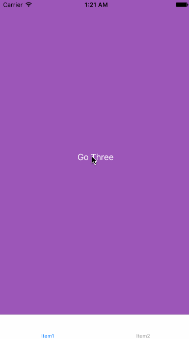
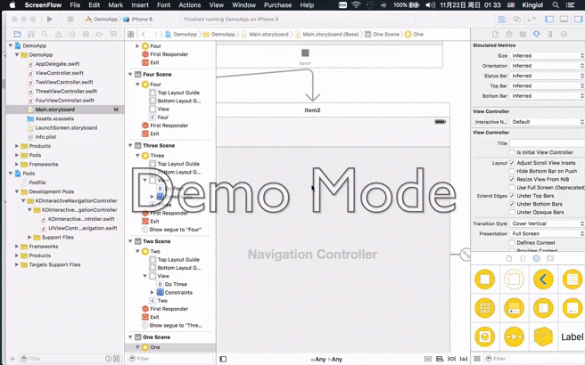

# KDInteractiveNavigationController

[](https://github.com/kingiol/KDInteractiveNavigationController/blob/master/LICENSE)
[](https://github.com/kingiol/KDInteractiveNavigationController)
[](https://github.com/kingiol/KDInteractiveNavigationController)



## Features :sparkles:

- UINavigationController interactive with UINavigationBar hidden or show
- Hide all UINavigationController backButtonItem's title, only show back arrow

## Requirements

- iOS 8.0+
- Xcode 7.1+

## Installation

### CocoaPods
[CocoaPods](http://cocoapods.org) is a dependency manager for Cocoa projects. You can install it with the following command:

```bash
$ gem install cocoapods
```

> CocoaPods 0.39.0+ is required to build.

To integrage KDInteractiveNavigationController into your Xcode project using CocoaPods, specify it in your `Podfile`:

```ruby
source 'https://github.com/CocoaPods/Specs.git'
platform :ios, '8.0'
use_frameworks!
inhibit_all_warnings!

pod 'KDInteractiveNavigationController'
```

Then, run the following command:

```bash
$ pod install
```

### Carthage
[Carthage](htps://github.com/Carthage/Carthage) is a decentralized dependency manager that builds your dependencies and provides you with binary frameworks.

You can install Carthage with [Homebrew](http://brew.sh/) using the following command:

```bash
$ brew update
$ brew install carthage
```

To integrate KDInteractiveNavigationController into your Xcode project using Carthage, specify it in your `Cartfile`:

```ogdl
github 'kingiol/KDInteractiveNavigationController'
```

Run `carthage` to build the framework and drag the built `KDInteractiveNavigationController.framework` into your Xcode project.

## Usage - Easy to Use

### UINavigationController interactive

> default UINavigationBar is show, when you want hiden UINavigationBar
> in UIViewController `viewDidLoad` method

```swift
override func viewDidLoad() {
        super.viewDidLoad()
        // Do any additional setup after loading the view, typically from a nib.
        self.interactiveNavigationBarHidden = true
    }
```

### Hide all UINavigationController backButtonItem's title

> user KDInteractiveNavigationController instead of UINavigationController.
> then set `clearBackTitle = true`

### Storyboard



## Credits

AHKNavigationController was created by [@Kingiol](https://github.com/kingiol).

## License

AHKNavigationController is released under the MIT license. See LICENSE for details.